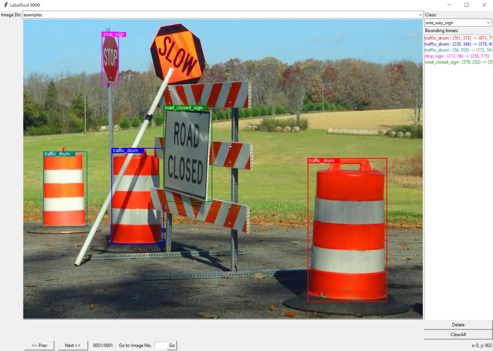

BBox-Label-Tool
===============
A multi-class bounding box labeling tool



Improvements in this fork
-------------------------
1. Conversion script to convert bounding box labels to YOLO format
2. Bounding boxes are now labeled
3. Dropdown menu for loading directories
4. Image resize script to resize images to a max height
5. No need to click "Confirm Class" Every time we switch classes

Installation
------------
#### Setting up virtualenv (optional)
```
$ sudo apt-get install python3 python3-venv -y 
$ python3 -m venv venv            # Create virtual environment
$ . venv/bin/activate             # Activate virtual environment
```
If everything works, your terminal should now look something like 
```
(venv) $
```
To deactivate,
```
(venv) $ deactivate
```

#### Install requirements (Use `pip` instead of `pip3` if using virtualenv)
```
$ pip3 install -r requirements.txt
```

Usage 
----------------------------------------
#### Preparing the images
Create folders in `Images/` and place your images in them, e.g. `Images/Dogs/`, `Images/Cats/`, etc. There is no strict requirement about what images need to be in which folders; this is just an organizational feature.
#### Running the labeling tool (Use `python` instead of `python3` if using virtualenv)
```
$ python3 main.py 
```
* To **change image directory**, use the dropdown menu next to `Image dir:`
* To **change object class**, use the dropdown menu under `Class:`
* To **draw a bounding box**, use your mouse to align the crosshairs and click at two corner points
* To **cancel drawing a bounding box**, press `esc`
* To **delete a bounding box**, select the box in the list and click the `Delete` button
* To **change images**, either use the left/right arrows on your keyboard, `a` or `d`, or click the buttons
* Annotations are saved in the following format: `<x1>, <y1>, <x2>, <y2>, <w>, <h>, <class>`, where `x1` `y1` `x2` and `y2` are the top left and bottom right coordinates of the bounding box, `w` and `h` are the width and height of the images, and `class` is the category of the bounding box.  
Figuring out the rest is left as an exercise to the reader.
#### Converting to YOLO Format (Use `python` instead of `python3` if using virtualenv)
```
$ python3 convert.py
```
Labels will be converted to [YOLO format](https://github.com/AlexeyAB/Yolo_mark/issues/60#issuecomment-401854885). Formatted labels will be saved in the specified folder, default is `YOLO_Formatted/`. Only images in the `Images` folder will have their labels converted. 

